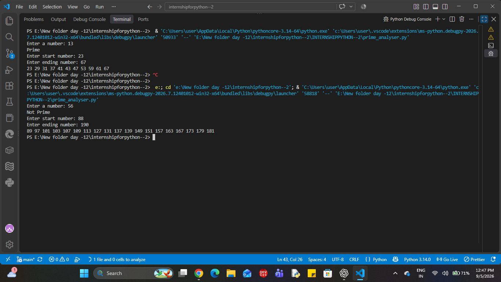

# INTERNSHIPPYTHON--2
after 12 days keep the internship continue.

# Day 12 – Palindrome Checker 🔄

## 📌 Task

Create a Python program that determines whether a word or sentence is a palindrome after normalizing the case and ignoring unnecessary spaces.

---

## 🎯 Objective

Practice:

- String manipulation
- String slicing
- String comparison
- Case normalization
- Handling spaces
- Conditional statements

---

## 🛠️ Tools Used

- Python
- VS Code

---

## 💡 Logic Used

1. Take a word or sentence as input from the user.
2. Convert the input into lowercase using `lower()`.
3. Remove unnecessary spaces using `replace()`.
4. Reverse the normalized string using string slicing `[::-1]`.
5. Compare the original normalized string with the reversed string.
6. Display whether the input is a palindrome or not.

---

## 💻 Python Code

```python
# Day 12 - Palindrome Checker

# Take input from the user
palindrome = input("Enter a word or sentence: ")

# Normalize the input
# Convert the input into lowercase
# Remove unnecessary spaces
normalized = palindrome.lower().replace(" ", "")

# Reverse the normalized string using slicing
reversed_text = normalized[::-1]

# Compare the normalized string with its reverse
is_palindrome = normalized == reversed_text

# Display the result
if is_palindrome:
    print("The input is a palindrome.")
else:
    print("The input is not a palindrome.")

c:\Users\user\OneDrive\Pictures\Screenshots\Screenshot 2026-09-04 114624.png


day - 13 
# Day 13 - Prime Number Analyzer

## 📌 Description

Build a Python program that checks whether a number is prime and generates all prime numbers within a specified range.

## 🎯 Objective

* Practice loops
* Practice conditions
* Practice functions
* Understand basic algorithmic thinking
* Learn optimized prime-number checking

## 🛠️ Tools Used

* Python
* VS Code

## 💡 My Logic

```text
# number input lena hai
# 0, 1 if not give the negative input
# for loop for iterations
# possible divisior honge toh phir prime no ka concept is over
# divisor mila toh False
# agar koi divisor nahi mila toh True
# number**0.5 se unnecessary divisibility checks avoid karna hai
# start number and ending number lena hai
# range ke andar har number ko check karna hai
# is_prime function ko reuse karna hai
```

## ⚙️ Algorithm

1. Take a number as input.
2. If the number is less than 2, return `False`.
3. Check possible divisors using a `for` loop.
4. Check divisibility using `%`.
5. If a divisor is found, return `False`.
6. Check only up to the square root of the number to avoid unnecessary checks.
7. If no divisor is found, return `True`.
8. Take a starting and ending number.
9. Check every number in the range using the reusable `is_prime()` function.
10. Display the prime numbers.

## 🧪 Example

```text
Enter a number: 17
Prime

Enter start number: 10
Enter ending number: 30

11 13 17 19 23 29
```

## 🧠 Interview Questions

### 1. What is a prime number?

A prime number is a number that is divisible only by 1 and itself.

### 2. How can the prime-checking algorithm be optimized?

First, check edge cases like 0 and 1. Then check divisibility only up to the square root of the number to avoid unnecessary checks.

### 3. What is algorithm complexity?

Algorithm complexity tells us how much time or memory an algorithm needs as the input size increases. It is commonly represented using Big O notation.

## 📊 Complexity

The optimized `is_prime()` function takes approximately:

**Time Complexity: O(√n)**

## 📚 Key Learning

* Functions
* `for` loops
* `if` conditions
* `%` modulo operator
* `return`
* Square-root optimization
* Function reuse
* Basic algorithm complexity

## ✅ Deliverables

* [x] Prime checker
* [x] Prime-number range generator
* [x] Algorithm explanation
* [x] Interview questions
* [x] Edge-case handling
day - 13 screenshot

