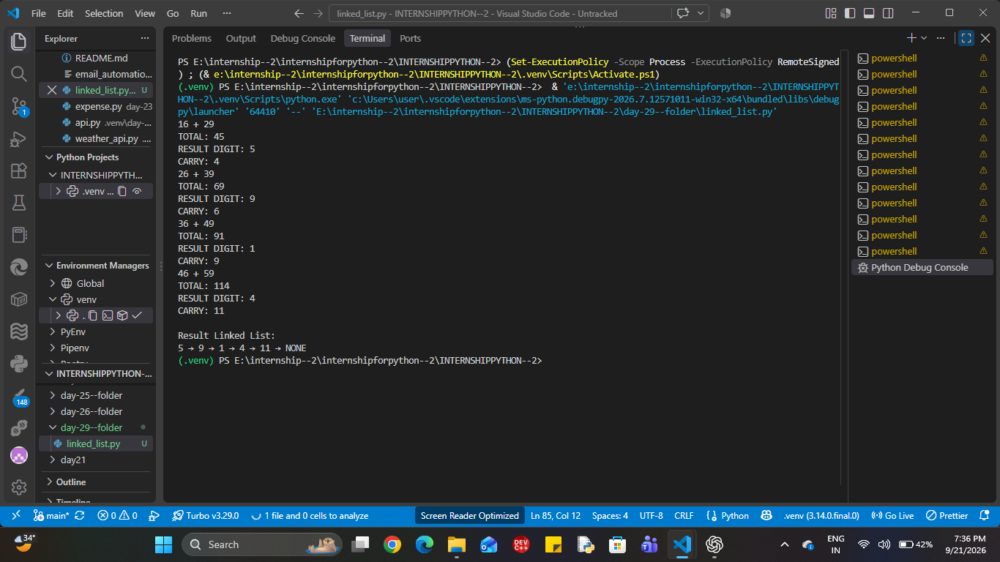

# 🔗 Linked List Addition in Python

## 📌 Project Overview

This project demonstrates the **addition of two linked lists in Python** using nodes, traversal, carry handling, and a new result linked list.

The main purpose of this program is to understand how two linked lists can be traversed simultaneously and how the **result digit and carry** are handled during addition.

---

## 🎯 Objectives

* Understand the structure of a linked list in Python.
* Create and connect linked-list nodes.
* Traverse two linked lists simultaneously.
* Understand the concept of `carry`.
* Separate the result digit and carry.
* Create new nodes for the result list.
* Use a `dummy` node and `tail` pointer to build the result list.

---

## 🧠 Logic

For every pair of nodes:

```text
total = value1 + value2 + carry
```

Then:

```text
result_digit = total % 10
carry = total // 10
```

The `result_digit` is stored in a new node.

The new node is attached to the result linked list using:

```python
tail.next = new_node
tail = new_node
```

The process continues until both linked lists have been traversed.

If a carry remains at the end, a final node is created for it.

---

## 🔄 Program Flow

```text
Create First Linked List
        ↓
Create Second Linked List
        ↓
Set current1 and current2
        ↓
Initialize carry = 0
        ↓
Create dummy node
        ↓
Traverse both lists
        ↓
Calculate total
        ↓
Extract result digit
        ↓
Calculate carry
        ↓
Create new node
        ↓
Attach node using tail
        ↓
Move current1 and current2
        ↓
Check remaining carry
        ↓
Display Result Linked List
```

---

## 🧩 Important Concepts

### 1. Node Creation

```python
class Node:
    def __init__(self, data, next=None):
        self.value = data
        self.next = next
```

### 2. Carry

```python
carry = total // 10
```

### 3. Result Digit

```python
result_digit = total % 10
```

### 4. Creating a New Node

```python
new_node = Node(result_digit)
```

### 5. Connecting the New Node

```python
tail.next = new_node
tail = new_node
```

---

## 🛠️ Technologies Used

* Python
* Linked List
* Classes and Objects
* Pointers/References
* Traversal
* Arithmetic Operations

---

## 📚 What I Learned

Through this program, I practiced:

* Creating a linked list from scratch.
* Connecting nodes using `.next`.
* Maintaining multiple traversal pointers.
* Understanding `carry` during addition.
* Creating a separate result linked list.
* Using a dummy node to simplify result-list construction.
* Updating the `tail` pointer after inserting a new node.

---

## ⚠️ Note

The lists used in this practice program contain values such as:

```text
16 → 26 → 36 → 46
29 → 39 → 49 → 59
```

This program was primarily created to understand **linked-list traversal, carry handling, and new-node creation**.

The same concepts can later be applied to the standard **LeetCode Add Two Numbers** problem, where each node normally contains a single digit.

---

## 🚀 Future Improvement

* Handle linked lists of different lengths.
* Handle remaining nodes when one list ends earlier.
* Implement the standard LeetCode `ListNode` format.
* Solve **LeetCode #2 — Add Two Numbers**.
* Add test cases for different inputs.

---

## 👨‍💻 Author

**Harsh Chauhan**

B.Tech CSE (AI/ML)

Hindustan College of Science and Technology

---

## ⭐ Key Formula

```text
total = value1 + value2 + carry

result_digit = total % 10

carry = total // 10
```

> **Practice focus:** Understand the logic first, then implement it independently.
# 🔗 Linked List Addition in Python

## 📌 Project Overview

This project demonstrates the **addition of two linked lists in Python** using nodes, traversal, carry handling, and a new result linked list.

The main purpose of this program is to understand how two linked lists can be traversed simultaneously and how the **result digit and carry** are handled during addition.

---

## 🎯 Objectives

* Understand the structure of a linked list in Python.
* Create and connect linked-list nodes.
* Traverse two linked lists simultaneously.
* Understand the concept of `carry`.
* Separate the result digit and carry.
* Create new nodes for the result list.
* Use a `dummy` node and `tail` pointer to build the result list.

---

## 🧠 Logic

For every pair of nodes:

```text
total = value1 + value2 + carry
```

Then:

```text
result_digit = total % 10
carry = total // 10
```

The `result_digit` is stored in a new node.

The new node is attached to the result linked list using:

```python
tail.next = new_node
tail = new_node
```

The process continues until both linked lists have been traversed.

If a carry remains at the end, a final node is created for it.

---

## 🔄 Program Flow

```text
Create First Linked List
        ↓
Create Second Linked List
        ↓
Set current1 and current2
        ↓
Initialize carry = 0
        ↓
Create dummy node
        ↓
Traverse both lists
        ↓
Calculate total
        ↓
Extract result digit
        ↓
Calculate carry
        ↓
Create new node
        ↓
Attach node using tail
        ↓
Move current1 and current2
        ↓
Check remaining carry
        ↓
Display Result Linked List
```

---

## 🧩 Important Concepts

### 1. Node Creation

```python
class Node:
    def __init__(self, data, next=None):
        self.value = data
        self.next = next
```

### 2. Carry

```python
carry = total // 10
```

### 3. Result Digit

```python
result_digit = total % 10
```

### 4. Creating a New Node

```python
new_node = Node(result_digit)
```

### 5. Connecting the New Node

```python
tail.next = new_node
tail = new_node
```

---

## 🛠️ Technologies Used

* Python
* Linked List
* Classes and Objects
* Pointers/References
* Traversal
* Arithmetic Operations

---

## 📚 What I Learned

Through this program, I practiced:

* Creating a linked list from scratch.
* Connecting nodes using `.next`.
* Maintaining multiple traversal pointers.
* Understanding `carry` during addition.
* Creating a separate result linked list.
* Using a dummy node to simplify result-list construction.
* Updating the `tail` pointer after inserting a new node.

---

## ⚠️ Note

The lists used in this practice program contain values such as:

```text
16 → 26 → 36 → 46
29 → 39 → 49 → 59
```

This program was primarily created to understand **linked-list traversal, carry handling, and new-node creation**.

The same concepts can later be applied to the standard **LeetCode Add Two Numbers** problem, where each node normally contains a single digit.

---

## 🚀 Future Improvement

* Handle linked lists of different lengths.
* Handle remaining nodes when one list ends earlier.
* Implement the standard LeetCode `ListNode` format.
* Solve **LeetCode #2 — Add Two Numbers**.
* Add test cases for different inputs.

---

## 👨‍💻 Author

**Harsh Chauhan**

B.Tech CSE (AI/ML)

Hindustan College of Science and Technology

---

## ⭐ Key Formula

```text
total = value1 + value2 + carry

result_digit = total % 10

carry = total // 10
```

> **Practice focus:** Understand the logic first, then implement it independently.
