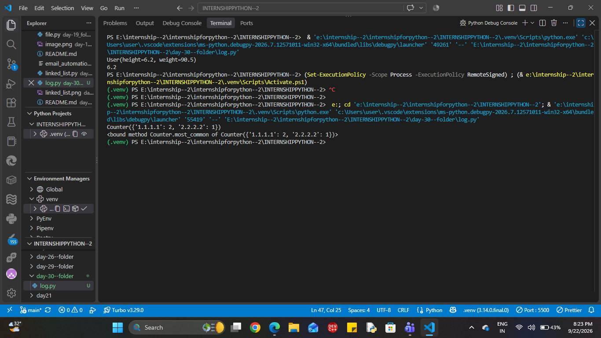

# Log File Analyzer

A Python-based log analysis tool that reads server log files, parses request information, and generates useful statistics such as total requests, error responses, frequently occurring IP addresses, and commonly requested endpoints.

This project was built as part of **Day 30 — Python Programming Track** to practice file handling, string processing, structured data representation, and basic data analysis using real-world-style server logs.

## 🚀 Features

* Reads and processes server log files
* Parses log entries into structured data
* Handles malformed or invalid log lines safely
* Counts total requests
* Identifies error responses
* Finds the most frequent IP addresses
* Identifies the most requested endpoints
* Uses `Counter` for efficient frequency analysis
* Uses `dataclasses` for clean and structured log-entry representation
* Uses `Optional` typing for values that may not be available
* Uses type annotations for clearer and more type-safe data handling
* Separates log parsing from analysis for cleaner code organization

## 🧠 What This Project Demonstrates

### Log Parsing

Each log line is processed to extract important information such as:

* IP address
* HTTP method
* Endpoint
* Status code

Invalid or malformed entries can be skipped instead of stopping the entire analysis.

### Type-Safe Data Handling

Python type annotations and `Optional` are used to make the expected data types clearer and reduce ambiguity while working with parsed log information.

### Structured Data with `dataclasses`

The `dataclasses` module provides a clean way to represent individual log entries as structured Python objects instead of relying only on loosely organized lists or dictionaries.

### Frequency Analysis with `Counter`

The `collections.Counter` class is used to efficiently count:

* IP addresses
* Endpoints
* Other frequently occurring values

## 📁 Project Structure

```text
log-file-analyzer/
│
├── log_analyzer.py
├── server.log
└── README.md
```

## ▶️ How to Run

### 1. Clone the repository

```bash
git clone <your-repository-url>
```

### 2. Navigate to the project directory

```bash
cd log-file-analyzer
```

### 3. Make sure Python is installed

Check your Python version:

```bash
python --version
```

### 4. Run the analyzer

```bash
python log_analyzer.py
```

The program will read the configured log file and display an analysis report containing request statistics, errors, top IP addresses, and frequently requested endpoints.

## 🛠️ Technologies Used

* **Python**
* **File Handling**
* **String Processing**
* **Type Annotations**
* **`typing.Optional`**
* **`dataclasses`**
* **`collections.Counter`**

## 📊 Example Analysis

The analyzer can produce information such as:

```text
===== LOG FILE ANALYSIS =====

Total Requests: 100

Error Responses: 12

Top IP Addresses:
192.168.1.10 : 25
192.168.1.15 : 18
192.168.1.20 : 14

Most Requested Endpoints:
/home     : 30
/login    : 22
/products : 18
```

## 🎯 Learning Objectives

This project helped strengthen practical understanding of:

* Reading files with Python
* Processing text-based data
* Parsing structured log information
* Working with dictionaries and counters
* Handling invalid input
* Using Python type annotations
* Designing structured data with `dataclasses`
* Separating parsing and analysis logic
* Producing meaningful information from raw operational data

## 🔮 Future Improvements

Possible extensions include:

* Support for Apache/Nginx log formats
* Date and time-based analysis
* HTTP method statistics
* Response-code distribution
* CSV/JSON report generation
* Command-line arguments for selecting log files
* Large-file streaming optimization
* Visualization of log statistics

## 👨‍💻 Project

**Day 30 — Python Programming Track**

This project focuses on transforming raw server logs into structured information that can help developers and operations teams understand application activity and identify potential issues.

