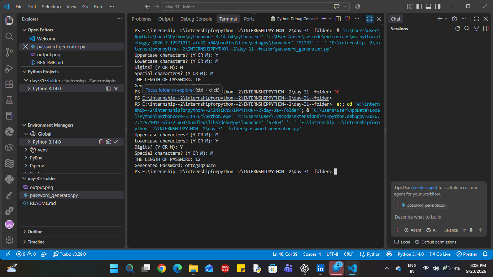

# 🔐 Password Generator

## 📌 Project Overview

This project is a configurable **Password Generator** developed in Python as part of the **Veda Technology Python Programming Internship — Task 31**.

The program allows users to choose the types of characters they want to include in a password and specify the required password length.

It uses Python's `secrets` module for security-oriented random character selection.

## 🎯 Objective

The objective of this task is to practice:

* Python modules
* Functions and loops
* Randomization
* User input handling
* String manipulation
* Exception handling
* Basic secure programming concepts

## ✨ Features

* User-defined password length
* Uppercase character selection
* Lowercase character selection
* Digit selection
* Special character selection
* Secure random character generation using `secrets`
* Input validation and exception handling
* Generated passwords are not automatically stored

## 🛠️ Technologies Used

* **Python**
* `secrets` module
* `string` module

## 📚 Modules Used

### `string`

The `string` module provides predefined character sets used to construct the password character pool.

```python
string.ascii_uppercase
string.ascii_lowercase
string.digits
string.punctuation
```

### `secrets`

The `secrets` module is used to generate security-oriented random values.

```python
secrets.choice(character_pool)
```

This selects one character from the available character pool.

## ⚙️ How the Program Works

```text
Select character types
        ↓
Create individual character pools
        ↓
Combine selected pools
        ↓
Enter password length
        ↓
Generate random characters
        ↓
Build password
        ↓
Display generated password
```

## ▶️ How to Run

### 1. Clone the repository

```bash
git clone <repository-url>
```

### 2. Open the project directory

```bash
cd <project-directory>
```

### 3. Run the program

```bash
python password_generator.py
```

## 💻 Sample Execution

```text
Uppercase characters? (Y OR M): Y
Lowercase characters? (Y OR M): Y
Digits? (Y OR M): Y
Special characters? (Y OR M): Y

THE LENGTH OF PASSWORD: 12

Generated Password: [sample generated password]
```

The generated password will vary each time because the program uses secure random selection.

## 🔒 Secure Programming Practices

This project follows the security-related guidelines provided in the task:

* Uses `secrets` instead of `random` for password generation.
* Avoids predictable password-generation patterns.
* Does not automatically store generated passwords.
* Validates password length.
* Handles invalid input using exception handling.

## 🧪 Error Handling

The program handles invalid situations such as:

### Invalid password length

```text
THE LENGTH OF PASSWORD: 0
Error: Password length must be greater than 0.
```

### No character type selected

```text
Error: At least one character type must be selected.
```

### Invalid length input

If the user enters non-numeric input for the password length, the program handles the resulting `ValueError`.

# 🎤 Interview Questions

These are the interview questions provided in the **Veda Technology Task 31**.

## 1. Why is `secrets` preferred over `random` for passwords?

The `secrets` module is designed for generating cryptographically strong random values for security-sensitive applications. The `random` module is intended for general-purpose pseudo-random operations and is not suitable for security-sensitive password generation.

## 2. What makes a password strong?

A strong password generally has sufficient length and uses a diverse combination of character types, such as uppercase letters, lowercase letters, digits, and special characters. It should also avoid predictable patterns and easily guessable information.

## 3. Why should generated passwords not be logged?

Generated passwords are sensitive information. Logging them can expose the passwords through log files, monitoring systems, or other systems that have access to those logs. Therefore, passwords should not be automatically stored or logged.

## 📦 Deliverables

* Password generator program
* Configurable password length
* Character-type selection
* Sample generated passwords
* Exception handling
* Secure password generation using `secrets`

## 📖 Key Learning Outcomes

Through this task, I practiced:

* Python modules
* `secrets.choice()`
* `string` module
* Loops
* Conditional statements
* String concatenation
* User input
* Type conversion
* Exception handling
* Secure programming concepts

## 👨‍💻 Internship Information

**Organization:** Veda Technology
**Internship:** Python Programming Internship
**Task:** 31
**Project:** Password Generator
**Language:** Python

---

### ⚠️ Note

Generated passwords should be treated as sensitive information and should not be unnecessarily shared, stored, or logged.

