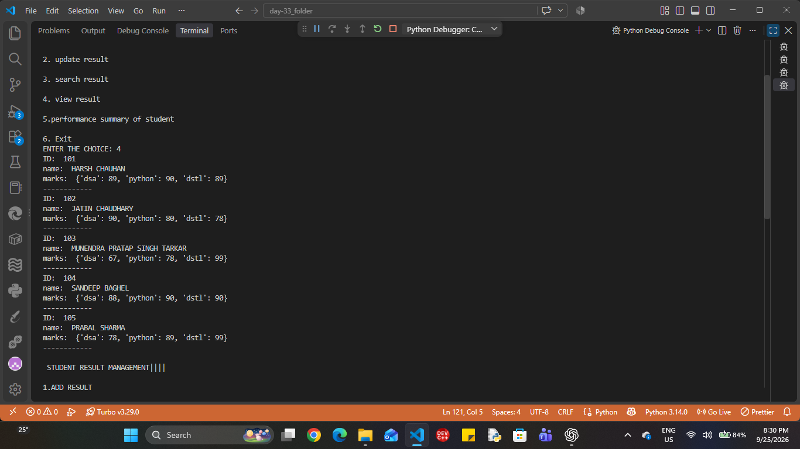

# Student Result & Grade Management System

## Veda Technology — Python Programming Internship

**Day:** 33 / 45
**Project:** Student Result & Grade Management System
**Language:** Python
**Interface:** Command-Line Interface (CLI)

---

## 📌 Project Description

The **Student Result & Grade Management System** is a Python-based CLI application designed to manage student details, subjects, marks, grades, and academic performance.

The project is being developed as part of my **Python Programming Internship at Veda Technology**.

For Day 33, the focus was on building the basic application structure, creating the student data structure, developing the CLI menu, and displaying existing student records.

---

## 🎯 Objective

The objective of this project is to practice Python fundamentals including:

* Variables
* Data types
* Lists
* Dictionaries
* Nested dictionaries
* Functions
* Loops
* Conditional statements
* User input
* Basic CLI application design

---

## 🛠️ Tools & Technologies

* Python
* VS Code
* Git
* GitHub

---

# 📂 Project Structure

The application currently follows this basic structure:

```text
Student Result Management System
│
├── Student Data
├── Functions
│   ├── Add Student
│   ├── Update Student
│   ├── Search Student
│   ├── View Student
│   └── Performance Summary
│
└── CLI Menu
```

---

# 🧑‍🎓 Step 1 — Student Data Structure

Student records are stored using a **list of dictionaries**.

Each student contains:

* Student ID
* Student Name
* Subject Marks

Example:

```python
students = [
    {
        "id": "101",
        "name": "HARSH CHAUHAN",
        "marks": {
            "dsa": 89,
            "python": 90,
            "dstl": 89,
        },
    }
]
```

The `marks` field is a nested dictionary containing subject-wise marks.

---

# 💻 Step 2 — CLI Development

A menu-driven CLI was created using a `while` loop and conditional statements.

```text
STUDENT RESULT MANAGEMENT

1. ADD RESULT
2. UPDATE RESULT
3. SEARCH RESULT
4. VIEW RESULT
5. PERFORMANCE SUMMARY OF STUDENT
6. EXIT
```

The user enters a choice, and the corresponding function is called.

Example:

```python
choice = input("ENTER THE CHOICE: ")

if choice == "1":
    add_students()

elif choice == "2":
    update_students()

elif choice == "3":
    search_students()

elif choice == "4":
    view_students()

elif choice == "5":
    performance_summary()

elif choice == "6":
    print("Program closed")
    break

else:
    print("Invalid choice")
```

---

# 📋 Step 3 — View Student Records

The `view_students()` function displays the existing student records.

```python
def view_students():
    for student in students:
        print("ID:", student["id"])
        print("Name:", student["name"])
        print("Marks:", student["marks"])
        print("------------")
```

The `for` loop iterates through the list and displays each student's information.

---

# 🖥️ Sample Output

```text
STUDENT RESULT MANAGEMENT

1.ADD RESULT
2. update result
3. search result
4. view result
5.performance summary of student
6. Exit

ENTER THE CHOICE: 4

ID: 101
name: HARSH CHAUHAN
marks: {'dsa': 89, 'python': 90, 'dstl': 89}
------------

ID: 102
name: JATIN CHAUDHARY
marks: {'dsa': 90, 'python': 80, 'dstl': 78}
------------

ID: 103
name: MUNENDRA PRATAP SINGH TARKAR
marks: {'dsa': 67, 'python': 78, 'dstl': 99}
------------

ID: 104
name: SANDEEP BAGHEL
marks: {'dsa': 88, 'python': 90, 'dstl': 90}
------------

ID: 105
name: PRABAL SHARMA
marks: {'dsa': 78, 'python': 89, 'dstl': 99}
------------
```

---

# ✅ Day 33 Progress

| Feature                      | Status      |
| ---------------------------- | ----------- |
| Student data structure       | ✅ Completed |
| CLI menu                     | ✅ Completed |
| Function structure           | ✅ Completed |
| View student records         | ✅ Completed |
| Add student functionality    | ⏳ Pending   |
| Update student functionality | ⏳ Pending   |
| Search functionality         | ⏳ Pending   |
| Grade calculation            | ⏳ Pending   |
| Performance summary          | ⏳ Pending   |

Only the features actually implemented during Day 33 are marked as completed.

---

# 🎤 Veda Technology — Interview Questions

### 1. What is the purpose of this project?

The purpose is to manage student details, subjects, marks, grades, and academic performance using a Python-based CLI application.

### 2. What data structure did you use?

I used a **list of dictionaries** to store multiple student records.

### 3. How are the marks stored?

Marks are stored in a nested dictionary containing subject names and their corresponding marks.

### 4. Why did you use functions?

Functions divide the application into separate operations such as adding, updating, searching, viewing, and generating performance summaries.

### 5. How does the CLI work?

The CLI displays a menu, accepts the user's choice, and calls the corresponding function using `if-elif` conditions.

### 6. Why did you use a `while` loop?

The `while` loop keeps the menu running continuously until the user selects the Exit option.

### 7. How are student records displayed?

The `view_students()` function uses a `for` loop to iterate through the `students` list and display each record.

### 8. How would you add a new student?

I would create a new student dictionary and use the `append()` method to add it to the `students` list.

### 9. How would you update a student's result?

I would search for the student using their ID and then modify the required information or subject marks.

### 10. How would you search for a student?

I would iterate through the student records and compare the entered ID or name with the stored information.

### 11. How would you calculate the student's total marks?

I would add all the subject marks stored in the student's marks dictionary.

### 12. How would you calculate percentage?

```text
Percentage = (Total Marks / Maximum Marks) × 100
```

### 13. How would you calculate the grade?

I would use conditional statements based on the calculated percentage.

### 14. How would you validate marks?

I would ensure that marks are within the valid range before storing them or calculating the result.

### 15. What is the purpose of the Performance Summary?

It is used to provide an overall academic result containing information such as total marks, percentage, and grade.

---

# 🚀 Future Development

The next development stages will include:

* Add student functionality
* Update student functional


