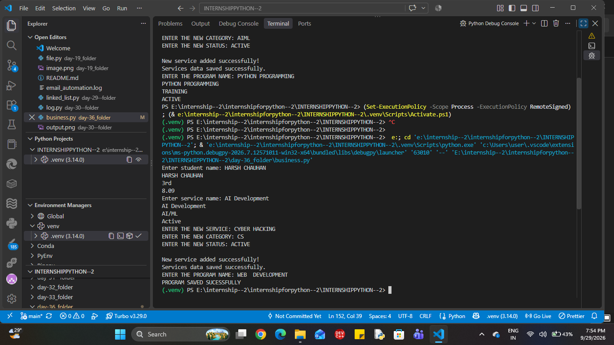
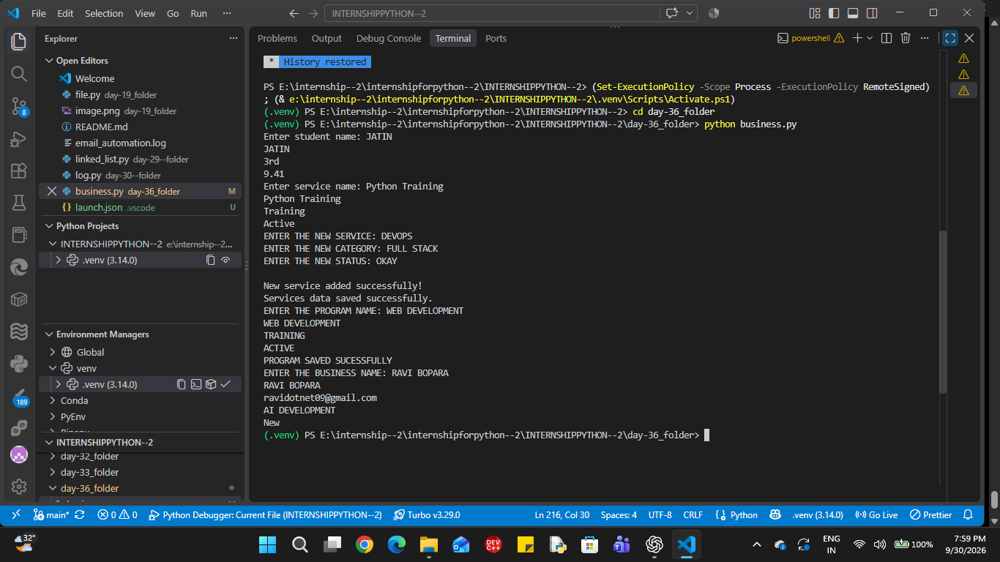

# Veda Technology Business & Service Management System

## Day 36 — Project Day 1 of 4

### Introduction

This project is a Python-based Business & Service Management System developed as part of the Veda Technology Python Programming Internship.

The project represents a technology and digital-services organization and will gradually manage services, programs, customers, inquiries, service requests, and basic business reports.

Day 36 focuses on building the initial data-handling and service-management foundation.

## Objective

* Practice Python lists and dictionaries
* Store structured business data
* Search records using loops and conditions
* Add new service records
* Use JSON for persistent data storage
* Build the foundation for a larger business-management application

## Technologies Used

* Python
* JSON
* VS Code
* Git
* GitHub

## Day 36 Features

### 1. Structured Data

Student information was used initially to practice storing records using a list of dictionaries.

Each record contains:

* Name
* Semester
* Marks

### 2. Student Search

The program searches for a student by name using a `for` loop and an `if` condition.

### 3. Service Management

Synthetic technology-service data is stored using a list of dictionaries.

Each service contains:

* Service name
* Category
* Status

### 4. Service Search

Users can enter a service name and retrieve its:

* Name
* Category
* Status

### 5. Add New Service

The program accepts:

* New service name
* Category
* Status

The new service is converted into a dictionary and added to the services list using `append()`.

### 6. JSON Storage

The service data can be stored in `services.json` using Python's built-in `json` module.

## Sample Service Data

```json
[
    {
        "name": "AI Development",
        "category": "AI/ML",
        "status": "Active"
    },
    {
        "name": "Web Development",
        "category": "Web",
        "status": "Active"
    },
    {
        "name": "Cloud Services",
        "category": "Cloud",
        "status": "Active"
    },
    {
        "name": "Python Training",
        "category": "Training",
        "status": "Active"
    }
]
```

## Basic Workflow

```text
Start
  ↓
Load/define service data
  ↓
Enter service name
  ↓
Search services
  ↓
Display service details
  ↓
Enter new service details
  ↓
Create dictionary
  ↓
Append to services list
  ↓
Save data to JSON
  ↓
End
```

## Data Safety

This project uses only synthetic/public-style information for demonstration and learning purposes.

It does not connect to or use private Veda Technology production data.

## Learning Outcomes

Through Day 36, I practiced:

* Lists
* Dictionaries
* Loops
* Conditional statements
* User input
* Dictionary key-value access
* `append()`
* JSON file handling
* Basic record searching
* Structured business data

## Project Status

**Day 36 of 45 — Project Day 1 of 4**

Current progress:

* [x] Basic data structure
* [x] Student search practice
* [x] Service data
* [x] Service search
* [x] Add service
* [x] JSON storage foundation
* [ ] Program management
* [ ] Customer management
* [ ] Inquiry management
* [ ] Service request management
* [ ] Search and filtering
* [ ] Business reports
* [ ] Final integration

These remaining features will be developed during the next project days.

## Internship

This project is being developed as part of the **Veda Technology Python Programming Internship**.


day 37 work . 
)
📅 Day 37 — Program Management


Day 37 extends the existing business workflow by adding technology programs.

Programs Included
Web Development
Python Programming
Cloud Services
AIML Program
Cyber Security Workshop
DevOps Program
Generative AI Workshop

Each program contains:

name
category
status
🔎 Program Search

Users can search for a program by its name.

Example:

ENTER THE PROGRAM NAME: PYTHON PROGRAMMING

PYTHON PROGRAMMING
TRAINING
ACTIVE
➕ Adding Multiple Programs

Multiple program records are stored inside a list:

new_program = [
    {...},
    {...},
    {...}
]

They are added to the main program list using:

programs.extend(new_program)

extend() is used because multiple dictionary records are being added to the existing list.

💾 JSON Storage

Program data is stored in:

programs.json

using:

with open("programs.json", "w") as file:
    json.dump(programs, file, indent=4)
🔄 Current Business Workflow
Student / User Data
        ↓
Services
        ↓
Programs
        ↓
JSON Storage

The project will be extended further in the upcoming development stages.

🧠 Python Concepts Practiced

During Day 36–37, the following concepts were practiced:

Lists
Dictionaries
List of dictionaries
for loops
if conditions
User input
Dictionary indexing
append()
extend()
File handling
JSON serialization
json.dump()
📂 Current Files
project/
│
├── main Python file
├── services.json
├── programs.json
└── README.md
🧪 Testing

The application was tested with:

Student Search
Enter student name: HARSH CHAUHAN

HARSH CHAUHAN
3rd
8.09
Service Search
Enter service name: Cloud Services

Cloud Services
Cloud
Active
New Service
AI DEVELOPMENT
AIML
ACTIVE
Program Search
ENTER THE PROGRAM NAME: PYTHON PROGRAMMING

PYTHON PROGRAMMING
TRAINING
ACTIVE

All tested operations executed successfully.

🔐 Data Safety

Only synthetic/example data is used in this project.

No private production data from Veda Technology is used.

🚀 Future Development

The project will be extended with:

Customer management
Customer inquiries
Service requests
Search and filtering
Business reports
Better JSON data loading
Modular Python files
Complete workflow integration
👨‍💻 Internship Project

Organization: Veda Technology
Internship: Python Programming Internship
Development Stage: Day 36–37
Language: Python




day - 38 --- > work.
# 📅 Day 38 — Customer / Business Management

Today, I extended the existing Business & Service Management System by adding **Customer/Business Management** to the workflow.

The previous implementation already contained service and program management. Day 38 focuses on storing customer/business information and searching records through the terminal.

---

## 🎯 Today's Objective

The objective of Day 38 was to:

* Create business/customer records
* Store multiple records using a list of dictionaries
* Search records by name
* Display customer/business details
* Practice terminal-based Python execution
* Continue extending the existing business workflow

---

## 👥 Customer / Business Data

Each record contains:

```text
name
email
service
status
```

Example:

```python
{
    "name": "RAHUL SHARMA",
    "email": "example@example.com",
    "service": "WEB DEVELOPMENT",
    "status": "New"
}
```

Multiple records are stored inside a list:

```python
business = [
    {
        "name": "RAHUL SHARMA",
        "email": "example@example.com",
        "service": "WEB DEVELOPMENT",
        "status": "New"
    }
]
```

---

## 🔎 Business Search

The application allows the user to search for a business/customer by name.

The search uses a `for` loop and an `if` condition:

```python
business_name = input("ENTER THE BUSINESS NAME: ")

for i in business:
    if i["name"] == business_name:
        print(i["name"])
        print(i["email"])
        print(i["service"])
        print(i["status"])
```

This follows the same list-of-dictionaries approach used earlier for services and programs.

---

## ➕ Adding a New Business

A new record can be created as a dictionary:

```python
new_business = {
    "name": "TECHNOVISTA SOLUTIONS",
    "email": "contact@example.com",
    "service": "AI DEVELOPMENT",
    "status": "New"
}
```

It can then be added to the existing list using:

```python
business.append(new_business)
```

---

## 💻 Terminal Execution

The Python program was also tested through the VS Code terminal.

The basic command used to run a Python file is:

```bash
python business.py
```

On Windows, the following command can also be used:

```bash
py business.py
```

---

## 🔄 Updated Business Workflow

The project workflow is now:

```text
Services
    ↓
Programs
    ↓
Customers / Business
    ↓
Search
```

The system will be extended further in the upcoming development stages.

---

## 🧠 Concepts Practiced Today

* Lists
* Dictionaries
* List of dictionaries
* `for` loops
* `if` conditions
* User input
* Dictionary indexing
* `append()`
* Python terminal execution

---

## 🧪 Testing

The customer/business search functionality was tested using synthetic records.

Example:

```text
ENTER THE BUSINESS NAME: RAHUL SHARMA

RAHUL SHARMA
example@example.com
WEB DEVELOPMENT
New
```

The search successfully displayed the corresponding record.

---

## 🔐 Data Safety

Only synthetic/example information should be used for testing this project. Private or production customer information is not required.

---

## 🚀 Next Development

The next stage can extend the workflow with:

* Customer inquiry management
* Service requests
* Status management
* JSON storage for customer records
* Search and filtering
* Business reports

These features are planned for future development and are not claimed as completed today.

---

## 📌 Day 38 Status

**Status:** Customer/Business Management foundation completed.

**Main Learning:** Using Python lists and dictionaries to represent and search structured business/customer records.
