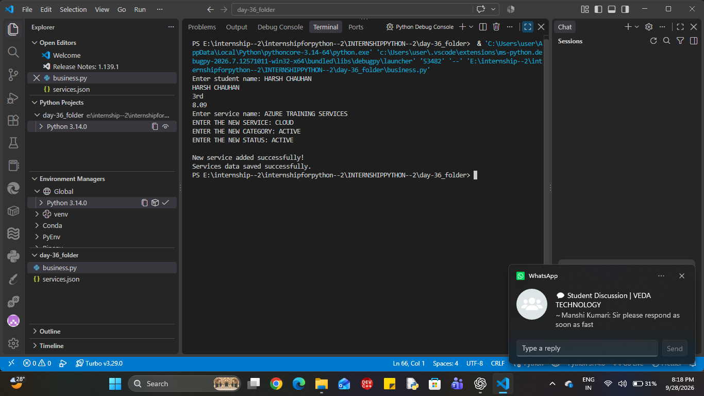

# Veda Technology Business & Service Management System

## Day 36 — Project Day 1 of 4

### Introduction

This project is a Python-based Business & Service Management System developed as part of the Veda Technology Python Programming Internship.

The project represents a technology and digital-services organization and will gradually manage services, programs, customers, inquiries, service requests, and basic business reports.

Day 36 focuses on building the initial data-handling and service-management foundation.

## Objective

* Practice Python lists and dictionaries
* Store structured business data
* Search records using loops and conditions
* Add new service records
* Use JSON for persistent data storage
* Build the foundation for a larger business-management application

## Technologies Used

* Python
* JSON
* VS Code
* Git
* GitHub

## Day 36 Features

### 1. Structured Data

Student information was used initially to practice storing records using a list of dictionaries.

Each record contains:

* Name
* Semester
* Marks

### 2. Student Search

The program searches for a student by name using a `for` loop and an `if` condition.

### 3. Service Management

Synthetic technology-service data is stored using a list of dictionaries.

Each service contains:

* Service name
* Category
* Status

### 4. Service Search

Users can enter a service name and retrieve its:

* Name
* Category
* Status

### 5. Add New Service

The program accepts:

* New service name
* Category
* Status

The new service is converted into a dictionary and added to the services list using `append()`.

### 6. JSON Storage

The service data can be stored in `services.json` using Python's built-in `json` module.

## Sample Service Data

```json
[
    {
        "name": "AI Development",
        "category": "AI/ML",
        "status": "Active"
    },
    {
        "name": "Web Development",
        "category": "Web",
        "status": "Active"
    },
    {
        "name": "Cloud Services",
        "category": "Cloud",
        "status": "Active"
    },
    {
        "name": "Python Training",
        "category": "Training",
        "status": "Active"
    }
]
```

## Basic Workflow

```text
Start
  ↓
Load/define service data
  ↓
Enter service name
  ↓
Search services
  ↓
Display service details
  ↓
Enter new service details
  ↓
Create dictionary
  ↓
Append to services list
  ↓
Save data to JSON
  ↓
End
```

## Data Safety

This project uses only synthetic/public-style information for demonstration and learning purposes.

It does not connect to or use private Veda Technology production data.

## Learning Outcomes

Through Day 36, I practiced:

* Lists
* Dictionaries
* Loops
* Conditional statements
* User input
* Dictionary key-value access
* `append()`
* JSON file handling
* Basic record searching
* Structured business data

## Project Status

**Day 36 of 45 — Project Day 1 of 4**

Current progress:

* [x] Basic data structure
* [x] Student search practice
* [x] Service data
* [x] Service search
* [x] Add service
* [x] JSON storage foundation
* [ ] Program management
* [ ] Customer management
* [ ] Inquiry management
* [ ] Service request management
* [ ] Search and filtering
* [ ] Business reports
* [ ] Final integration

These remaining features will be developed during the next project days.

## Internship

This project is being developed as part of the **Veda Technology Python Programming Internship**.



day 37 work . 